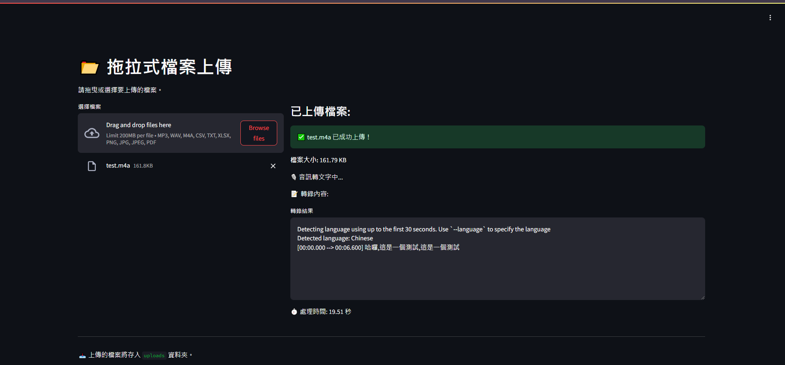

# File Upload and Speech-to-Text (STT) 介面系統

## 專案目標
提供一個簡單的介面，讓使用者可以上傳錄音檔，並使用 Whisper 模型將音檔轉換為文字，並顯示在網頁介面上。


### 上傳檔案介面與 Whisper 轉譯結果


### 需求套件
- `streamlit`：用於創建和顯示網頁應用。
- `whisper`：OpenAI 提供的語音辨識模型，將音檔轉換為文字。
- 其他基本 Python 套件：專案所需的其他依賴套件。
- Docker (選用)：如果希望在容器中運行此應用，可以選擇使用 Docker。
- Docker Compose (選用)：如果使用 Docker 部署，可以使用 Docker Compose 來簡化配置和啟動。

### 執行指令 (使用本機環境)
```bash
streamlit run app.py
```

## 建置映像檔(optional)
```bash
docker compose build
```

# 啟動系統(optional)
```bash
docker compose up -d
```